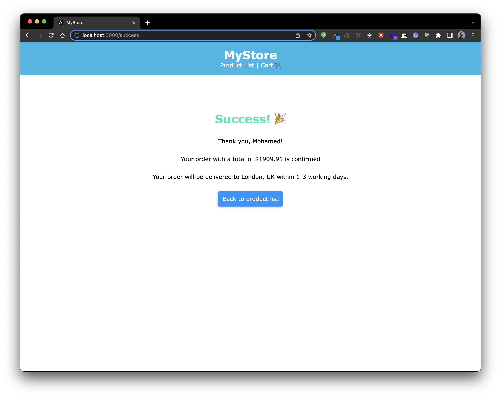

# MyStore

**MyStore** is a responsive e-commerce app to buy explore products, add them to cart, and checkout.

This app is built with [Angular](https://angular.io) 13.3

<p align="center"></p>

_The products list is loaded from a JSON file existing in `src/assets/data.json`._

---

## Get Started

Install the project dependencies by navigating to the project's root and run

```
npm install
```

## Development server

Run `ng serve` for a dev server. Navigate to `http://localhost:4200/`. The application will automatically reload if you change any of the source files.

You can change the dev server by adding `--port` to the `ng server` command. i.e.
```
ng serve --port 3000
```

## Build

Run `ng build` to build the project. The build artifacts will be stored in the `dist/` directory.

## Running unit tests

Run `ng test` to execute the unit tests via [Karma](https://karma-runner.github.io).

---

## Screenshots

### Home page (Product List)

### Product Details

### Cart


### Order Confirmation
